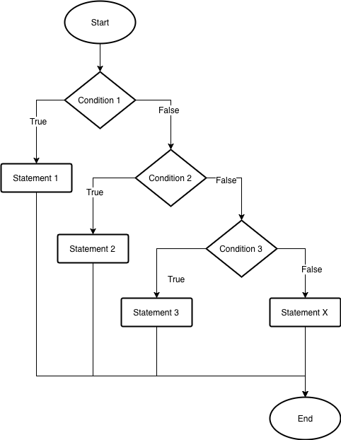
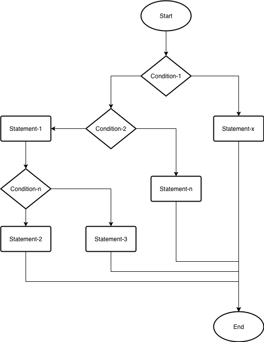
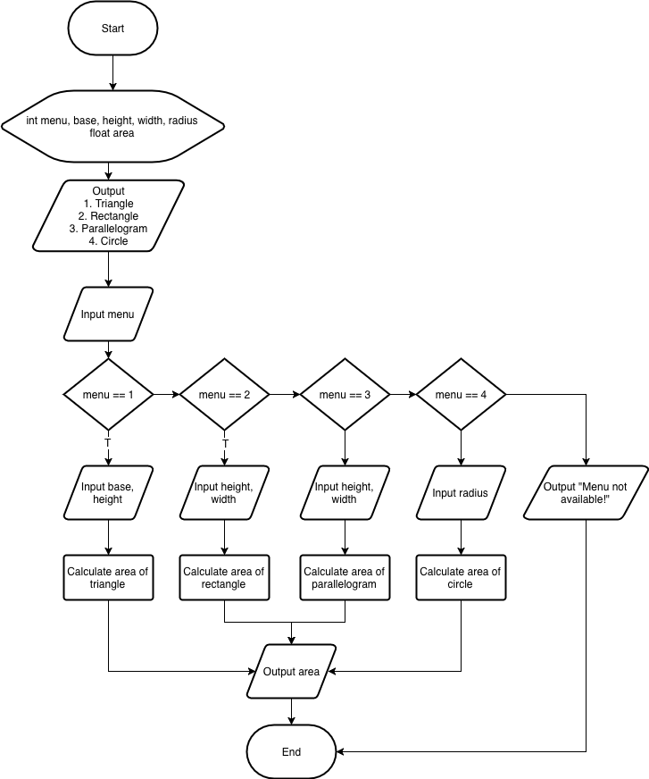

# Jobsheet 6 - Conditional 2

In the previous jobsheet, we learn about basic conditional. Furthermore, we will
discuss about condition inside condition (nested-if).

## Conditional syntax if-else-if



In picture above, statement 1 will be executed if **condition 1** is true. If
**condition 1** is false, then the program will check **condition 2**. If
**condition 2** is true, then **statement 2** will be executed, and so on. And
if there are no condition that fullfilled, **statement x** will be executed.
Please check the basic structure below.

```java
if (condition-1) {
  statement-1;
} else if (condition-2) {
  statement-2;
} else if (condition-3) {
  statement-3;
}
...
...
else {
  statement-3;
}
```

## Nested if

In statement `if`(or `if-else`) there may be a statement `if` (`if-else`). This
form called `nested-if`. As general, the structure can be described below:

```java
if (condition-1) {
  if (condition-2) {
    statement-1;
    ...
    ...
    if (condition-n) {
      statement-2;
    } else {
      statement-3;
    }
  } else {
    statement-n;
  }
} else {
  statement-x;
}
```

You can also check the flowchart below:



## Experiment
### Experiment 1

- Open your text editor
- Create file `.java` with give name `TrafficLight.java`
- Write basic structure function `main()`
- Add import statement `Scanner` library in top of program
- Declare Scanner variable to receive input
- Create variable with `String` datatype, give name `light`
- Ask user to input the color of light.
- Create structure to check condition of light
  - if light have green color, display "Please go!"
  - if light have yellow color, display "Be carefull!"
  - if light have red color, display "Stop!"
  - Otherwise display "Wrong Input!"

```java
import java.util.Scanner;

public class TrafficLight {
  public static void main(String[] args) {
    String light;
    Scanner sc = new Scanner(System.in);

    System.out.println("Input the color of light: ");
    light = sc.nextLine();

    if ("green".equals(light))
      System.out.println("Please go!");
    else if ("yellow".equals(light))
      System.out.println("Be carefull!");
    else if ("red".equals(light))
      System.out.println("Stop");
    else
      System.out.println("Wrong input!");
  }
}
```

### Question 1
- Explain the meaning of `"green".euals(light)`
- What output if the value of light is red? and why?

### Experiment 2
- Open your text editor
- Create file `.java` and give name `NestedIf.java`
- Write basic structure function `main()`
- Add import `Scanner` library at top of program
- Declare Scanner
- Create variable with `int` datatype, give name `value`
- Ask `value` from user
- Create structure to check value.
  - The value must between 0 - 100, Otherwise display "Invalid input!"
  - If the value is valid, check the passing grade of student.
  - If the value between 90-100, display "Your grade is A"
  - If the value between 80-89, display "Your grade is B"
  - If the value between 60-79, display "Your grade is C"
  - If the value between 50-59, display "Your grade is D"
  - If the value below 50, display "Your grade is E"

```java
import java.util.Scanner;

public class NestedIf {

  public static void main(String[] args) {
    Scanner scanner = new Scanner(System.in);
    System.out.print("Input your value: ");
    int value = scanner.nextInt();

    if (value >= 0 && value <= 100) {
      if (value >= 90) {
        System.out.println("Your grade is A");
      } else if (value >= 80) {
        System.out.println("Your grade is B");
      } else if (value >= 60) {
        System.out.println("Your grade is C");
      } else if (value >= 50) {
        System.out.println("Your grade is D");
      } else {
        System.out.println("Your grade is E");
      }
    } else {
      System.out.println("Invalid value");
    }
  }
}
```

### Question 2
- What the output if value is `-50`? Please explain!
- What the output if value is `90`? Please explain!

## Assignment

1. Create a program to find the biggest and smallest number from 3 inputted numbers!

2. Create a program using `if-else-if` syntax based on flowchart below!

  

3. Create a program to calculate the price based on total transaction
   specifically for members of store. The program needs member id (hardcoded in
   program), price and amount of item. If the member id is match, then:

   - If transaction less than 10 items, then no discount.
   - If transaction between 11 - 30 items, get 15% discount.
   - If transaction more than 30 items, get 30% discount.

   Display ouput total price before discount, discount and total price after
   discount!

4. Create a program that receives three input numbers. The input is represents
   angle value of triangle. If an angle equals to total two of angles, then
   display "Right Triangle" else "Not Right Triangle". The angle must fullfill
   requirements below:
  - Total three of angles equals to 180&deg;
  - The input can't be negative
  - Every angle must more than 0&deg; and less than 180&deg;
  - Display error message if the input is invalid.
