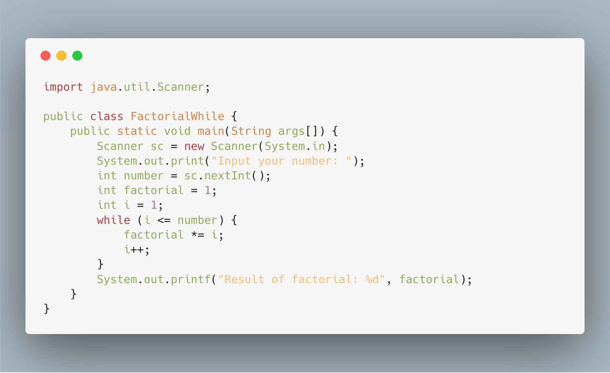

# Jobsheet 9 - Looping 1

Loop is a block or group instruction (statement) that executed repeatedly. The
purpose of loop or repetition to make the process more efficient. We can use
three syntaxes to create loop in java. Please check the basic structure below.

```java
// loop using for syntax
for (initialization; condition; update) {
  statement;
  ...
}

// loop using while syntax
while (condition) {
  statement;
  ...
}

// loop using do while syntax
do {
  statement;
  ...
} while (condition);
```

The loop syntaxes have condition that limit the repeat repetition. For and while
works by check the condition first then execute the statement. Do while works by
opposite way. You can check flowchart below to understand about the execution.


## Experiment
### Experiment 1

- Rewrite program below!

  - Looping using `for`

  

  - Looping using `while`

  

  - Looping using `do-while`

  

- Then check the result!

  

### Experiment 2

- Copy the looping program that using `break` below.

  - Looping using `for`

    

    > **Note** `for` without condition is equals to *infinite loop*

  - Looping using `while`

    

  - Looping using `do-while`

    

- Check the result of your program below!

    

### Experiment 3

- Rewrite the looping program that using `continue` below.

  

- Check the result of your program below!

  

## Assignment

1. (SumEven) Create a program that ask user positive number **N** (N > 0).
   Then program sum only even number. **Example**:

  - If user input N = 3, it means: 0 + 2 + 4 = 6
  - If user input N = 5, it means: 0 + 2 + 4 + 6 + 8 = 20

  > Program only needs to display the result of sum

2. (SumQuadrate) Create a program that ask user positive number **N** (N > 0).
   Sum operation use quadrate number {1, 4, 9, 16, 25, 36, ... N<sup>2</sup>}.
   **Example**:

   - If user input N = 2, it means: 1 + 4 = 5
   - If user input N = 3, it means: 1 + 4 + 9 = 14

3. (OddDigit) Create a program that ask user positive number **N** (N > 0).
   Program checks the total odd digit from number. **Example**:

   - If user input N = 2345, the total odd digit = 2
   - If user input N = 993312, the total odd digit = 5
